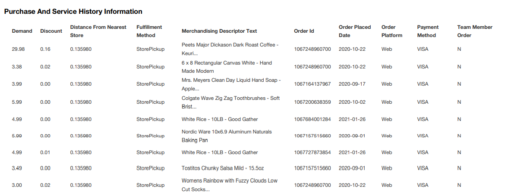
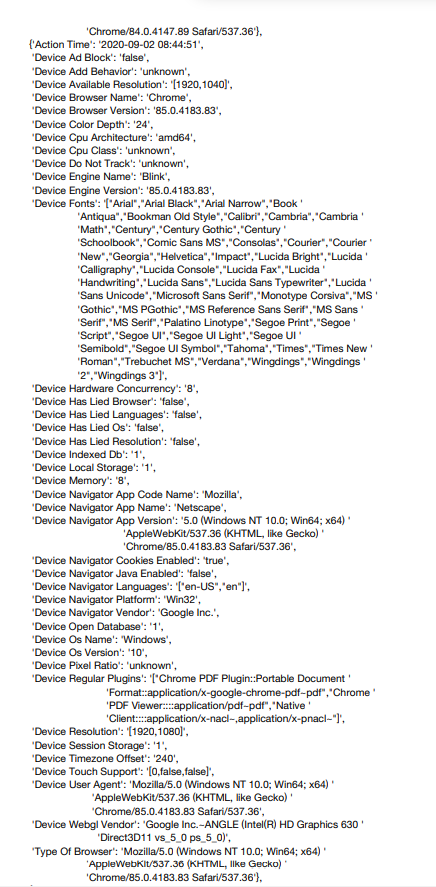
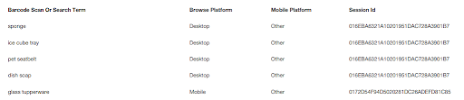
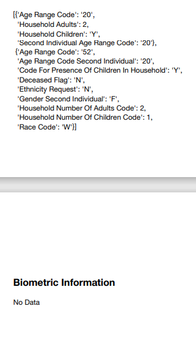

By [Sarah Gillespie](https://www.linkedin.com/in/sarahg4567/)
 
Published May 7, 2021
 

I have always been told that everything on the Internet stays forever, and so I act accordingly. But it’s different downloading all your own details from a corporate website.

As a California resident I was able to request my data under the [California Consumer Privacy Act](https://oag.ca.gov/privacy/ccpa) (CCPA). CCPA is a 2018 law giving Californians the right to know about the personal information a business collects about them and how it is used and shared; the right to delete personal information collected from them; the right to opt-out of the sale of their personal information; and the right to non-discrimination for exercising their CCPA rights.

I turned to the big box retailer with whom I have spent more money that I want to admit during my college career. It took over a month from my initial request to be able to download my data PDF from the Target website. The data release was 114 pages long, beginning with standard information, such as my account and home address details.

Then my data PDF provided a deep dive into things that would make any data analyst drool: the longitude and latitude of my address, distance between my home and nearest store, every single item I purchased since the CCPA was enforceable, if a purchased item item was on sale, if a purchased item was a seasonal item.

It was a trip back in time scrolling through all my purchases, including medical purchases, such as  'UP&UP CREAM HYDRO 1 OZ ANTITCH CRM' from when I worked at a Girl Scout camp and was plagued by mosquitoes. Medical purchases are personal. I hope my medical purchase details are not accidentally released to the public in a data breach. Target already had [a data breach in 2013 that resulted in a $18.5 million settlement to 47 states and the District of Columbia](https://www.nytimes.com/2017/05/23/business/target-security-breach-settlement.html).

```{r Target Purchase History, fig.cap="Caption: The first nine entries in my Target purchase history from the CCPA data release. From left to right, 'Demand' is the sticker price; 'Discount' is the total discount I recieved on the item; the distance between my home address and the relevant store; Fulfillment Method; the item's website description; the order identification number; the date I placed the order; the method I used to place the order; and a column titled 'Team Member Order'", echo=FALSE, out.width="100%"}

```

Target also logged my computer and browser details each time I visited their website.

```{r Target Computer Details, fig.cap="Caption: The computer and browser details from a single visit. The details correctly note my browser was Google Chrome along with other technical triva about my device.", echo=FALSE, out.width="100%"}

```

And the report included every single search I typed into the query bar.

```{r Target Search Details, fig.cap="Caption: From left to right, the specific query I typed into the Target website's search bar; the device type I used when searching; a column titled 'Mobile Platform'; a column titled 'Session ID'", echo=FALSE, out.width="100%"}

```

Target guessed at my family’s salary and my household rank. Household salary was a categorical variable, so I can’t be sure what income bracket they think my family falls into. The report did not specify how Target got this data: I would never share my household income with a company, so Target could be inferring this from census data, the type of Target goods I purchase, or purchasing third-party income data.

Household categorization was hit-and-miss. Target correctly classified my mom and me as a household, but not did not group in my stepfather who also lives at that California address or my roommate and me who share an apartment. The company knew my race as “white,” even though I do not remember sharing that information. The corporation also recorded my level of education, that I am not part of the military, and that I am not currently deceased (as of March 2021).

```{r Target Household Dynamics, fig.cap="Caption: Target's attempted understanding about my household dynamics", echo=FALSE, out.width="100%"}

```

The report included over 100 pages of data gathered just two years: this expansive document makes me wonder my value to Target and the marginal value of each piece of information about me and the products I purchase. 

The groundbreaking paper criticizing Google, “[On the Dangers of Stochastic Parrots: Can Language Models Be Too Big?](https://dl.acm.org/doi/10.1145/3442188.3445922)” brings up the environmental concerns of storing too much data for machine learning models. When data is “in the cloud,” the information is really located in a giant server warehouse. The electricity powering storing this data is both financially expensive and climate costly. Target’s executives and myself are unlikely to feel the environmental consequences of overzealous energy consumption and data storage: instead, it is the traditional victims of climate change who will suffer.

My mom and I have frequented Target since I was a little kid, hopping on the linoleum tiles polished into a mirror finish as my mom picked out jeans that would fit me while I begged for a Barbie from the next aisle over. I’m sure the goal of collecting this data is to track and retain me as a consumer over my lifetime. Maybe the corporation, living in the upper echelons of the Fortune 500, hopes for a future with a more advanced model to feed my data into so that they can gain even more consumer insight. And maybe I’m a too kind-hearted and short-sighted quantitative economics major, but I don’t think all this data is worth keeping. To protect the environment, to protect people’s sensitive purchasing habits, and to reduce corporate expenditure, Target should just press delete on a heck of a lot of personal data.

