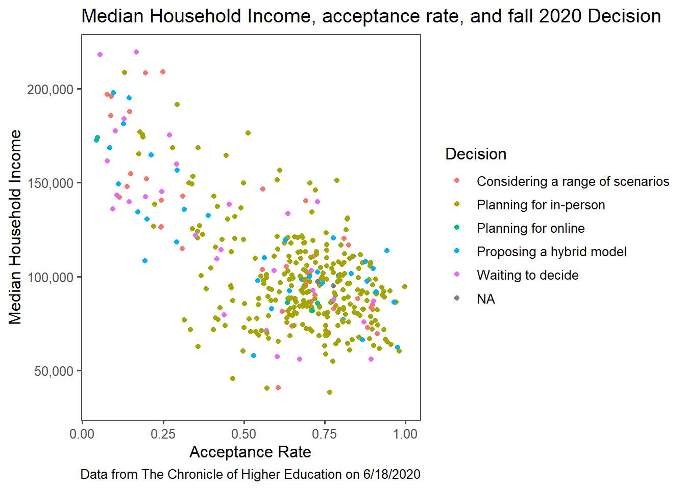
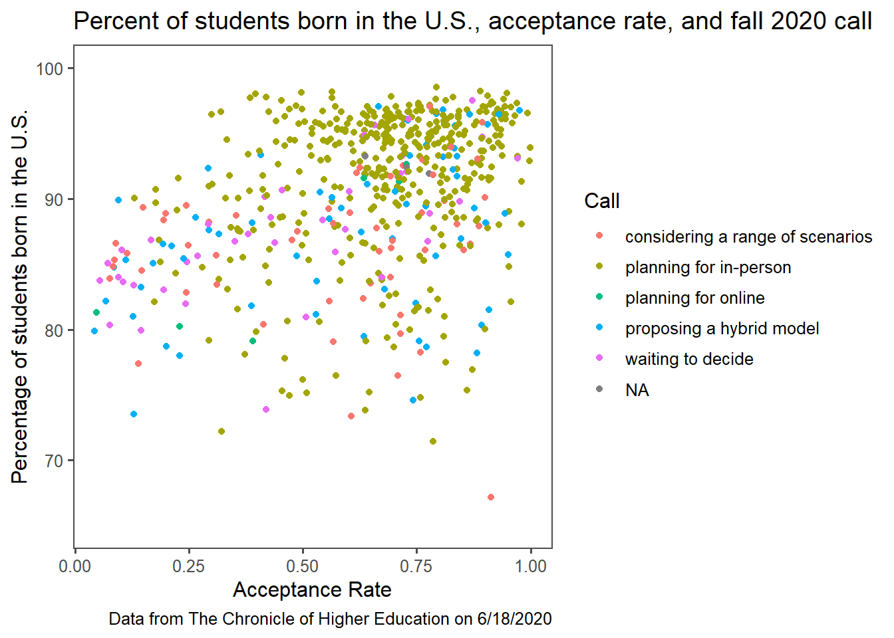
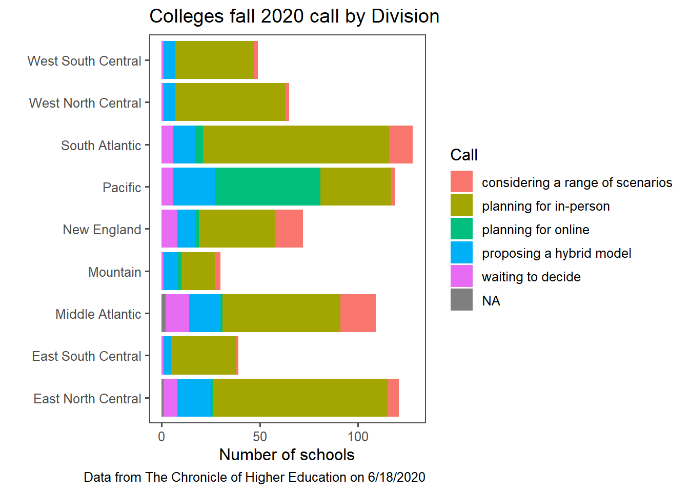
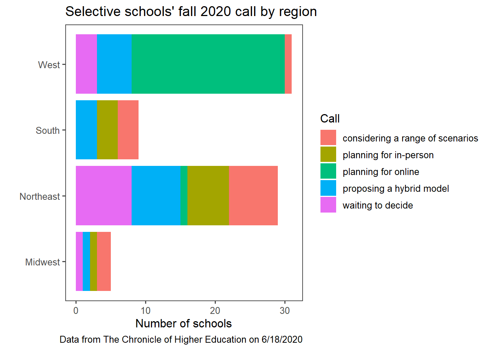

 By Sarah Gillespie
 
Published June 5, 2021

Graphs produced June 18, 2020

```{r fall_2020_dec_median_hh_income, fig.cap="Caption: Fall descision compared to a school's median household income and acceptance rate", echo=FALSE, out.width="100%"}

```

```{r fall_2020_dec_pct_born_in_US, fig.cap="Caption: Fall descision compared to a school's percentage of U.S.-born students and acceptance rate", echo=FALSE, out.width="100%"}

```

```{r fall_2020_dec_region, fig.cap="Caption: Fall descision broken down by nine geographic regions", echo=FALSE, out.width="100%"}

```

```{r fall_2020_dec_selective_schools, fig.cap="Caption: Selective school's fall descision broken down by four geographic regions", echo=FALSE, out.width="100%"}

```

My school, Smith College, was one of the last schools to announce plans for the fall 2020 semester. As the summer rolled on, no details were being released about fall plans so I hoped to discover my school’s most likely fall plans based on schools with similar demographics’ plans for the fall. It seemed each institution made COVID-19 policy decisions independently, but had a response like demographically similar colleges. Hours after Princeton announced classes would be taught remotely, Smith sent a similar email. Amherst College announced students would not return after spring break and other colleges in the Five College Consortium, including mine, imitated that decision in the following 48 hours. I predicted that Smith College’s COVID response would be similar to colleges in the United States that were also in Massachusetts, selective, all-women, or non-profit.

Unfortunately for me at the time, the one factor I found in common was that schools like Smith were also hesitant to release their fall plans. Later in the summer, the data set was made to be subscriber-only so I wasn’t able to re-run the graphs with new data but my hypothesis seems to have been correct: Smith College’s fall plan was nearly identical to Wellesley and Mount Holyoke’s plans and had many of the same aspects as Harvard and Amherst Colleges’ plans. When Smith College was one of the first schools to reverse course to an all-remote semester in the fall, this pattern persisted: Mount Holyoke and Harvard announced a fully remote semester within a few days, too.

My academic experience and work have been fully remote for two and a half semesters. It’s been a bittersweet experience: there has been so much loss and missed experiences that could have been avoided in a COVID-free parallel universe. But I am grateful to have improved my resiliency, grit, and community connection in ways that may not have occurred with a traditional college experience. I am lucky to have been able to have a successful remote year with few barriers: something absent from these graphs is how student challenges shaped institutional policy decisions. A school may have planned for in-person instruction if a sizable subset of the student body doesn’t have adequate internet access to attend virtual classes. Schools with an international population may chose online and hybrid models because travel bans would have prevented their students from accessing an in-person education.

Data was sourced from The Chronicle of Higher Education; Harvard’s Opportunity Insights Baseline Cross-Sectional Estimates of Child and Parent Income Distributions by College; and United States Department of Education’s most recent institution-level data.
