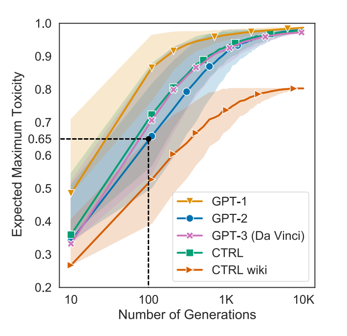

 By [Sarah Gillespie](https://www.linkedin.com/in/sarahg4567/)
 
 Published October 11, 2021
 
<br>


### Overview

Biased data can create a biased algorithm in a two main ways. First, collecting data where the given information is incorrect (intentionally or unintentionally) and using that data to train a model can lead to outputs that reflect that incorrect data. Second, since models recreate and amplify patterns found in the given data, a model trained with undiverse data can amplify existing biases in the data, including biases agaaisnt protected classes.

<br>

### Data that can identify an individual person

If a person is from a group that is outside the norm, there is risk their data could be used to identify them and they would have to deal with the repercussions of all the survey information not being personally identifiable rather than anonymous. Inaccurate or missing data can lead to a less precise model and the design of surveys can induce that bias into the data. The paper, [How Algorithms Discriminate Based on Data They Lack: Challenges, Solutions, and Policy Implications](https://www.jstor.org/stable/pdf/10.5325/jinfopoli.8.2018.0078.pdf), speaks to how questions about identity can impact marginalized groups in different ways than the majority group by exposing members of marginalized groups to more risk if the data is de-anonymized.

>Unfortunately, while uncovering bias may require collecting sensitive identity data, doing so can also entail potential harms and risks. General concerns about data protection and privacy are heightened when respondents have marginalized identities or identities that will be relatively rare in that context. Their social categories increase the likelihood that their data can be de-anonymized, the risk that they will be targeted specifically, or the harm that could occur if their records are compromised.

One way the [United States Census Bureau](https://www.census.gov/newsroom/blogs/research-matters/2018/08/protecting_the_confi0.html) deals with this dilemma is using “noise injection” to help protect the privacy of survey respondents before the census data is published for the public.

>To help prevent anyone from tracing statistics back to a specific respondent, we alter the underlying statistical tabulations before publication. This process is called “noise injection.” It has been a key feature of our confidentiality protection systems for decades. However, this process is a delicate balancing act. Enough noise must be added to protect confidentiality, but too much noise could damage the statistic’s fitness-for-use.
Using our previous disclosure avoidance systems, we are not able to share details of the noise added to the data in order to protect confidentiality. This means users have no idea how much any estimate may be altered from its measured value due to the application of historical disclosure avoidance procedures.

### Hardcoding current biases

By not training algorithms on the style of data you wish the algorithm to create. An algorithm’s output mimics the world that is given to it and can amplify existing biases. A Reuters articles described a recruiting algorithm Amazon trained based on its successful hires’ and past applicants’ resumes. The company’s experimental hiring tool used artificial intelligence to score  job candidates scores.

“Everyone wanted this holy grail,” one of the people said. “They literally wanted it to be an engine where I’m going to give you 100 resumes, it will spit out the top five, and we’ll hire those.”

The resume did successfully output what it thought were the top applicants based on past applicants’ resumes. Unfortunately, neither the tech giant’s past resume pool nor payroll were particularly diverse. Both groups were overwhelmingly white, male, and from affluent backgrounds. Without specifying anything, the resume algorithm picked up on this pattern. The impact was the training algorithm penalized people with the word “women” on their algorithm and graduates of two all-women’s colleges.

A large natural language processing model, GPT-3, was trained on vast amounts of  written text on the internet, including Reddit comments. Internet forum comments fed into OpenAI’s GPT models have a double-edged sword effect: the data style makes GPT-3’s language generation much more natural but the model also repeats many common cuss words and slurs. GPT-3 can be fine-tuned with different texts, but struggles to keep the content of its generation “workplace appropriate.” 


<br>


### Preventing these problems

For GPT-3, a research paper published by the University of Washington, [RealToxicityPrompts: Evaluating Neural Toxic Degeneration in Language Models](https://aclanthology.org/2020.findings-emnlp.301/), showed how training a similar natural language processing model on Wikipedia data reduced the amount of non-workplace appropriate generations. 
 
 
```{r Fig 2 RTP paper, fig.cap="Source: Figure 2 in [RealToxicityPrompts: Evaluating Neural Toxic Degeneration in Language Models](https://aclanthology.org/2020.findings-emnlp.301/) <br> Caption: The orange line and area shows the expected number of “toxic,” essentially workplace inappropriate language generations by [Salesforce’s CTRL model](https://arxiv.org/abs/1909.05858) trained on Wikipedia data. Training CTRL on Wikipedia data did not eliminate the toxic language generations but did reduce the generations compared to the untrained CTRL model and the series of GPT models.", echo=FALSE, out.width="100%"}

```

The Amazon recruiting algorithm was likely not trained on a dataset that had a pool of candidates that reflected the diversity in hires that recruiters and managers wanted. This could have been solved by curating a more diverse and representative set of data (resumes) that differ from the status quo and using that dataset to train the model. This can avoid hard-coding and amplifying human biases that created the representation and rhetoric in your status quo dataset.

The takeaway is that quality data takes intentional effort to curate. Building enough trust with people for them to give accurate information about themselves and choosing the data that emphasizes the world you want to create to avoid reiterating the status quo are two actionable steps that algorithm builders can do to ensure more fair algorithms.
