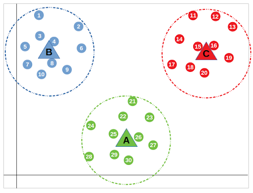
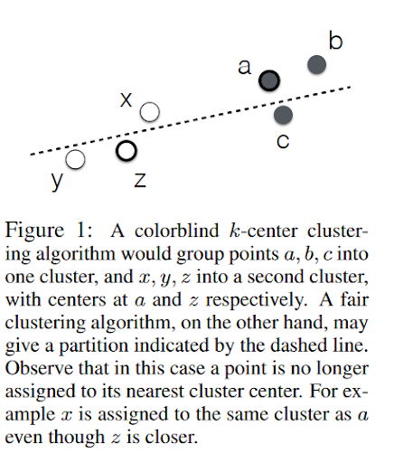

By [Sarah Gillespie](https://www.linkedin.com/in/sarahg4567/)
 
 Published October 18, 2021
 
### Overview

Some of the most common grouping algorithms are not infallible against accidentally grouping by protected classes. K-means and k-medians can be susceptible to falling into the “ZIP code problem.” The ZIP code problem is a situation where the United States Postal Service assigned geographic code in effect becomes a proxy variable for race due to historic redlining practices. This results in stark racial and economic divides throughout cities that persist to the present day. Systemic racism and sexism in the United States have created many such proxy variables like the ZIP code problem.


<br>

### How this occurs

As a refresher, k-grouping algorithms is an unsupervised machine learning technique that groups a collection of data points into subgroups based on a certain feature the points share. For the k-median grouping algorithm, the algorithm uses “centroids”, k different randomly-initiated points in the data, and assigns every data point to the nearest centroid. After every point has been assigned, the centroid is moved to the median of all of the points assigned to it. The same grouping strategy is used for [k-means](https://towardsdatascience.com/how-does-k-means-clustering-in-machine-learning-work-fdaaaf5acfa0).

```{r TDS k-means, fig.cap="Source: [How Does k-Means Clustering in Machine Learning Work?](https://towardsdatascience.com/how-does-k-means-clustering-in-machine-learning-work-fdaaaf5acfa0) by Anas Al-Masri for Toward Data Science <br> Caption: This example of k-means groupings shows how a collection of data points on a Cartesian plane can be classified into three bubble-like sub-groups.", echo=FALSE, out.width="100%"}

```

If a person uses a k-grouping algorithm to create groups based on ZIP codes or another proxy variable for a protected class, the effect can still be segregated clusters. If a person groups students by SAT score, then they most likely unintentionally simultaneously grouped students by family income.If a person groups members of a city by ZIP code, they most likely also created clusters that each have a homogenous racial group rather than each cluster representing the city’s diversity.


<br>


### Concrete solution: preprocessing step to create diverse clusters

There is a solution to have groups clustered around your variable of interest while still having each cluster be roughly representative of the overall data’s population diversity. Algorithm builders can apply a pre-processing step that creates clusters based on the variable of interest as well as prioritizing each cluster being roughly the same diversity as the population as  a whole. This means the groups may be more spread out than a classic k-grouping algorithm but can be diverse based on one or more protected groups. 

The below example, from [Fair Clustering Through Fairlets](https://papers.nips.cc/paper/2017/hash/978fce5bcc4eccc88ad48ce3914124a2-Abstract.html), shows the grouping algorithm applied with  two different diversity attributes: point color and point outline. 

```{r FCtF fig 1, fig.cap="Source: Figure 1 from [Fair Clustering Through Fairlets](https://papers.nips.cc/paper/2017/hash/978fce5bcc4eccc88ad48ce3914124a2-Abstract.html).<br>Caption: Grouping that accounts for the proportion of different subgroups do a verbal form of this graph.", echo=FALSE, out.width="100%"}

```

Just this one preprocessing step can reduce unintended grouping segregation like the ZIP code problem. The result is still grouping by common factors, except preserving the diversity of the data rather than unintentionally segregating different populations. The cost is slightly more spread out groups that aren’t quite the same as the groups produced by classical k-grouping methods, but more representation of the populations that exist in the overall dataset.

Code to pre-process this additional preprocessing grouping step using Fair-Lloyd algorithm is on Github: [https://github.com/fairkmeans/Fair-K-Means-Clustering](https://github.com/fairkmeans/Fair-K-Means-Clustering)
Unfortunately, this algorithm is in Matlab rather than Python or R.
