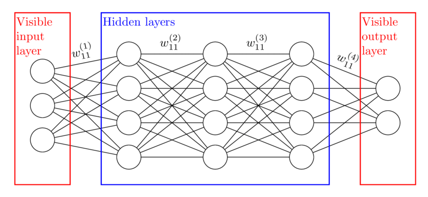

 By Sarah Gillespie
 
 Published October 28, 2021


### Deep learning structure

Deep learning faces a lack of robustness in some settings, such as being vulnerable to adversarial inputs, not being able to rationalize its predictions, and not able to provide protection for stakeholders against data that does not conform to the model’s training data. Deep learning methods’ struggle with unpredictability and unaccountability means these algorithms have very limited usage in high stakes applications such as security or safety critical applications. The paper [Deep k-Nearest Neighbors: Towards Confident, Interpretable and Robust Deep Learning](https://arxiv.org/pdf/1803.04765.pdf) proposes the DkNN documentation method to address these challenges.

```{r img_blog_post_Alg_Bias_3B_An-example-of-a-deep-learning-neural-network-with-3-hidden-layers-For-a-Boltzmann, fig.cap="Source: Adcock, Jeremy & Allen, Euan & Day, Matthew & Frick, Stefan & Hinchliff, Janna & Johnson, Mack & Morley-Short, Sam & Pallister, Sam & Price, Alasdair & Stanisic, Stasja. (2015). Advances in quantum machine learning. <br>Caption: An example of a deep learning neural network with 3 hidden layers. Each layer is specified as a vector of binary components, with the edges between the vectors defined as a matrix of weight values.", echo=FALSE, out.width="100%"}

```
### Deep k-Nearest Neighbors (DkNN)


DkNN uses the classic k-nearest neighbors algorithm along with representations of the data learned by each layer of the deep neural network grouping method to produce documentation on . DkNN is excellent at producing documentation to answer why a deep-learning model groups each input to its specific output.

The goal of DkNN is to provide documentation on why a deep learning algorithm chose the category that it did and how much the person using the algorithm's results should trust that output. This is crucial in settings like using deep learning in situations where security and reliablity are paramount, like the financial or military industries.

The research paper introducing DkNN describes this as "ensure that each intermediate computation performed by the deep neural network is conformal with the final prediction that it makes.”

### Does DkNN change the model?

No.
It’s all about creating documentation as the model categorizes an input. DkNN method performs a nearest neighbor search to find training points most similar to the given input. This occurs on each hidden layer of the deep learning process. This produces documentation that wouldn't otherwise exist and a “behind the scenes” view about how the deep learning algorithm is classifying each individual input.

The model's output with DkNN will be exactly the same as without DkNN: the only difference is that DkNN lists some of the reasons why a model selected that output through listing the input's neighboring points in each layer and some other metrics about how reliable the outputted categorization might be.

```{r img_blog_post_Alg_Bias_3B_recipt2, fig.cap="Source: Getty Images <br>Caption: Grouping .", echo=FALSE, out.width="100%"}
knitr::include_graphics("img_blog_post_Alg_Bias_3B_recipt2.jpg")
```


### Adversarial Input


Deep neural networks generally work fine with some small randomness in input data but sometimes give the wrong output due to (the input being a little different from the training data)+(a weak point in the model). This is exploitable. People can purposefully make a model classify things wrong if they knows that weak point. Access to the source code and training data is not needed.


```{r img_blog_post_Alg_Bias_3B_phantomplate, fig.cap="Source: www.phantomplate.com <br>Caption: Techniques used to obscure license plate numbers to avoid tickets from running red lights or routine tolls are adversarial input.", echo=FALSE, out.width="100%"}
knitr::include_graphics("img_blog_post_Alg_Bias_3B_phantomplate.gif")
```


When an algorithm is classifying lots of points with little human interaction, how could the algorithm know if a point is intentionally exploiting an algorithm's weak spot?

The solution is to create a credibility score.


### Numbers about the numbers
The paper introduces two novel measurements: credibility scores and confidence scores. These measurements could alert the people running the algorithm to potential adversarial inputs or if the model is extrapolating too much from limited data.

*Credibility*: characterizes how relevant the training data is to the prediction.

Credibility score = $\frac{# of nearest neighbor points that DON’T match the input’s final output label}{total number of nearest neighbors considered}$

A large credibility score means that it is more likely the input is adversarial or otherwise wrongly classified. The credibility score range is [0, 1]. A score of 0 means that all of the point's nearest neighbors are the same group that the point's final classification is while a score of 1 means that none of the point's nearest neighbors are the same group as the point's final classification. The credibility score exists for an individual hidden layer and the model as a whole.


*Confidence*: quantifies the likelihood of the prediction being correct.

Confidence score = the distance between the test input and the model’s NN training points

Theconfidence score is relative to other input's confidence scores. A large score, compared to other inputs' confidence scores, means the point is less similar to the model's training data and may be too much of an outlier to correctly classify. The confidence score range is [0, \infty). Just like the credibility score, the confidence score exists for an individual hidden layer and the model as a whole.

```{r img_blog_post_Alg_Bias_3B_DkNN_drawing, fig.cap="<br>Caption: An illustration of confidence and credibility scores in a three hidden layer model using 5 nearest neighbor points per layer.", echo=FALSE, out.width="100%"}
knitr::include_graphics("img_blog_post_Alg_Bias_3B_DkNN_drawing.jpg")
```

If the outputted classification and the training data are in agreement, then the DkNN algorithm’s prediction is likely to be accurate. However, if there is a disconnect between the representation prediction and the training data then the output is likely to be an inaccurate prediction through being too much of an outlier or being an adversarial input. Same with the confidence score: regardless of the classification output, if a point is too geographically far from its neighbors then that increases the likelihood that the point is an adversarial input or too obscure for the model to correctly classify based on the model’s training data.


### DkNN Application Areas

#### 1. Documentation of analysis

Goal: make sure the intermediate steps’ output conforms with the final output. This is useful for documenting model analysis when a model's training data might change over time or when the model's output may be called into question at the moment of creation or farther away in time.

DkNN achieves this goal by creating a list of an input’s nearest neighbors in each layer.

```{r img_blog_post_Alg_Bias_3B_recipt1, fig.cap="Source: Figure .<br>Caption: Grouping .", echo=FALSE, out.width="50%"}

```


#### 2. Inform about outliers

Puts up a red flag if there is an input point that dissimilar to the training data.

DkNN achieves this goal by informing the model's users that the model might be extrapolating too much from its training data. Again, DkNN does not change in inputs, categorization, or output of a model: it simply is a way to produce documentation about how and why the model grouped a specific point.

#### 3. Adversarial Points

Puts up a red flag if it is likely that there is purposeful exploitation of the model’s grouping weaknesses.

Goal: prevent exploited outputs from having a real-world impact.

#### 4. Help the models catagorization be interpretable to people.


The explanations provided by looking at an input’s distance from its nearest neighbors are intuitive and interpretable by humans when trying to understand a model’s specific decision. For example, if an individual was denied a mortgage, a person questioning the model’s decision can learn that the denial was due to an individual's debt-to-income ratio rather than the house’s location or value.

This can be legally important when a [Right to Explaination](https://en.wikipedia.org/wiki/Right_to_explanation) exists, such as in the General Data Protection Regulation. The Right to Explaination is a right to be given an explanation for an algorithm's output, particularly if the output has legal or financial implications. For simple groupings, like classical k-means or standard nearest neighbors, this is an easy task. For deep learning algorithms their combinations of hidden layers, abstract parameters, and adjustable weights make providing a Right to Explaination much more of a challenge. DkNN helps provide the Right to Explaination by generating documentation that can inform about the input's most related training points and provide the confidence and credibility scores that detail how related the input was to the existing training points and how valid the categorization may be.


To conclude, DkNN is not a silver bullet solution to deep learning’s problems, but it does provide an opportunity for more context on how an algorithm is grouping points. The DkNN grouping can be used to flag inputs that are too far outside the norm to be classified accurately, but the DkNN process  does not alter the deep learning model. The benefit to fairness is that a given model can be much more interpretable and increase a model’s ability to have its outputs checked by people.

### Big idea to take DkNN further:
#### Use DkNN to reduce GPT-3's toxic language generation

GPT-3 frequently produces toxic language, mimicking the toxic language present in its natural language training data. The current approach is mass banning all potentially toxic words if using the model in a sensitive setting. This has an effect of making the model seem less like natural language and misses toxic words, phrases, or nuances that are not present in the banned words list. There is potential in using DkNN to trace the neural networks and subnetworks that *might* be most associated with the toxic output, especially toxic output that occurs more frequently than it is present in the training data. Then, it might be possible to "turn off" those collections of model neurons or deweight the model parameters that are most correlated with toxic language production.

### DIY

The code for the [Deep k-Nearest Neighbors: Towards Confident, Interpretable and Robust Deep Learning](https://arxiv.org/pdf/1803.04765.pdf) paper: https://github.com/AgarwalVedika/DeepKNN/