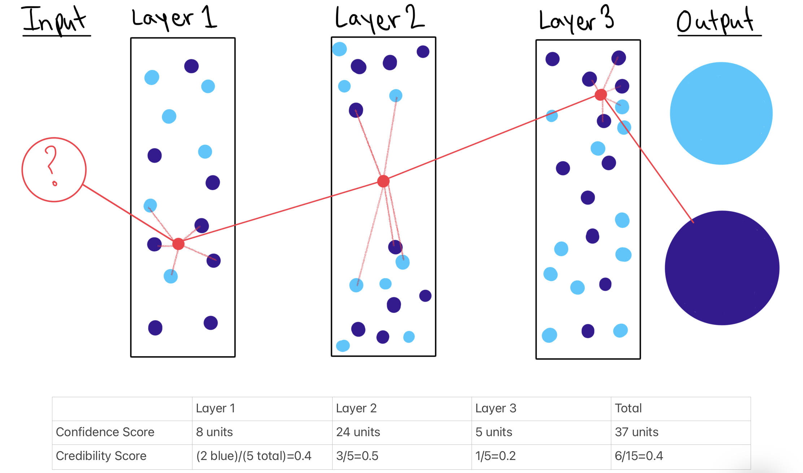

 By Sarah Gillespie
 
 Published November 2, 2021

### Deep k-Nearest Neighbors (DkNN)

This blog post is the accompanying in-depth math behind DkNN, detailed in [*Succinct Deep k-Nearest Neighbors Explanation* (fifteen-minute read)](https://sarahgillespie.github.io/SG/blog_post_Alg_Bias_3B.html). *Succinct Deep k-Nearest Neighbors Explanation* provides a quality overview of DkNN. This blog post is math notation that would be unnecessary to initially encounter when learning about DkNN.

To review, deep learning faces a lack of robustness in some settings, such as being vulnerable to adversarial inputs, not being able to rationalize its predictions, and not able to provide protection for stakeholders against data that does not conform to the model’s training data. The impact is these algorithms have very limited usage in high stakes applications such as security or safety critical applications, despite how advanced deep learning is in less critical settings. The unpredictability and unaccountability is a major barrier for the adoption of deep learning in high stakes settings.

 [Deep k-Nearest Neighbors: Towards Confident, Interpretable and Robust Deep Learning](https://arxiv.org/pdf/1803.04765.pdf) introduces two novel measurements: credibility scores and confidence scores. Unexpected measurements could alert the people running the algorithm to potential adversarial inputs or if the model is extrapolating too much from limited data. Assuming these measurements fall along a normal distribution from a collection of test inputs, if a credibility score or confidence score is too many standard devations away from the mean score then the model could put up a red flag for human intervention.

```{r img_blog_post_Alg_Bias_3B_DkNN_drawing, fig.cap="*Source: Sarah Gillespie illustration <br>Caption: An illustration of confidence and credibility scores in a three hidden layer model using 5 nearest neighbor points per layer.*", echo=FALSE, out.width="100%"}

```

In this drawing, I just guesstimated the distances between the input and nearest neighbor points using made-up data points and layers. You can calculate actual confidence and credibility scores using statistical software.

### Mathematical Notation for the Confidence Score
*Confidence*: quantifies the likelihood of the prediction being correct.

Confidence score = the distance between the test input and the model’s nearest neighboring training points, summed for each layer to create a confidence score for each layer and then the summation of layer confidence scores can be added together to get a confidence score for the model as a whole.

The confidence score does not exist in an informational vacuum: an algorithm user most consider the confidence score relative to other inputs' confidence scores. A large score, relative to other inputs' confidence scores. means the point is less similar to the model's training data and may be too much of an outlier to correctly classify. The confidence score range is [0, $\infty$). Just like the credibility score, the confidence score exists for an individual hidden layer and the model as a whole.

Let:

$ I$ be the model's input that is being analyzed in each hidden layer. The input point is located at $(x_{I}, y_{I})$ in each unique hidden layer.
 
 n be a specific nearest neighbor point located at $(x_{n}, y_{n})$.
 
 $\varphi$ be the total nearest neighbor points considered in each layer.
 
 We can use the distance formula, $\sqrt{(x_{2} - x_{1}) + (y_{2} - y_{1})}$, as a base to compute a single layer's confidence score. Note that the $(x, y)$ location is a simplistic representation of the point in a two-dimension Cartesian plane. This can vary but the mathematician must adapt the below formula for another representation of the two points. We sum up the distances between the input point and each nearest neighbor point to find a single hidden layer's confidence score.
 
 
 
$$\sum_{n=1}^{\varphi} \sqrt{(x_{n} - x_{I}) + (y_{n} - y_{I})}$$
 
We can find the confidence score for an entire model by summing up all the layers' confidence scores.
Let

$\lambda$ be a specific hidden layer

$\Lambda$ be the total number of hidden layers

  
$$\sum_{\lambda=1}^{\Lambda} \sum_{n=1}^{\varphi} \sqrt{(x_{n} - x_{I}) + (y_{n} - y_{I})}$$

If the deep learning classification output and the training data are in agreement (i.e. the input has a small credibility score and a small confidence score), then the DkNN algorithm’s prediction is likely to be accurate. However, if there is a disconnect between the representation prediction and the training data then the output is likely to be an inaccurate prediction. This can happen if an input is too much of an outlier or being an adversarial input. Same with the confidence score: regardless of the classification output, if a point is too geographically far from its neighbors then that increases the likelihood that the point is an adversarial input or too obscure for the model to correctly classify based on the model’s training data.

Summing up the score for each layer only works and is comparable because each input goes through the same series of layers. The confidence and credibility score approach would not work in a neural network model where each input is analyzed by some, but not all, of the model's neurons.

### Mathematical Notation for the Credibility Score

*Credibility*: characterizes how relevant the training data is to the prediction.

Use the same notation from above, let

$\varphi$ be the total nearest neighbor points considered in each layer

$\lambda$ be a specific hidden layer

$\Lambda$ be the total number of hidden layers

with the addition of letting

$\psi$ be the number of nearest neighbor points that are a different class than the input point's final classification.

A single layer's credibility score would be $\frac{\psi}{\varphi}$.

The credibility score for an entire model would be

$$\frac{\sum_{\lambda=1}^{\Lambda} \psi_\lambda}{\Lambda\varphi}$$

Note: in this formula, it is assumed that there is the same number of $\varphi$, the number of nearest neighbor points in each layer. Since we assume $\varphi$ is the same integer value for layer then we can multiply $\varphi$ by the total number of layers rather than doing summation notation on $\varphi$.

A large credibility score means that it is more likely the input is adversarial or otherwise wrongly classified. The credibility score range is [0, 1]. A score of 0 means that all of the point's nearest neighbors are the same group that the point's final classification is while a score of 1 means that none of the point's nearest neighbors are the same group as the point's final classification. The credibility score exists for an individual hidden layer and the model as a whole.


### DIY

The code for the [Deep k-Nearest Neighbors: Towards Confident, Interpretable and Robust Deep Learning](https://arxiv.org/pdf/1803.04765.pdf) paper: https://github.com/AgarwalVedika/DeepKNN/